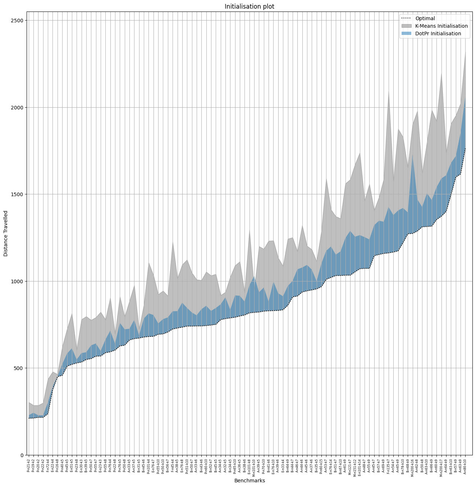
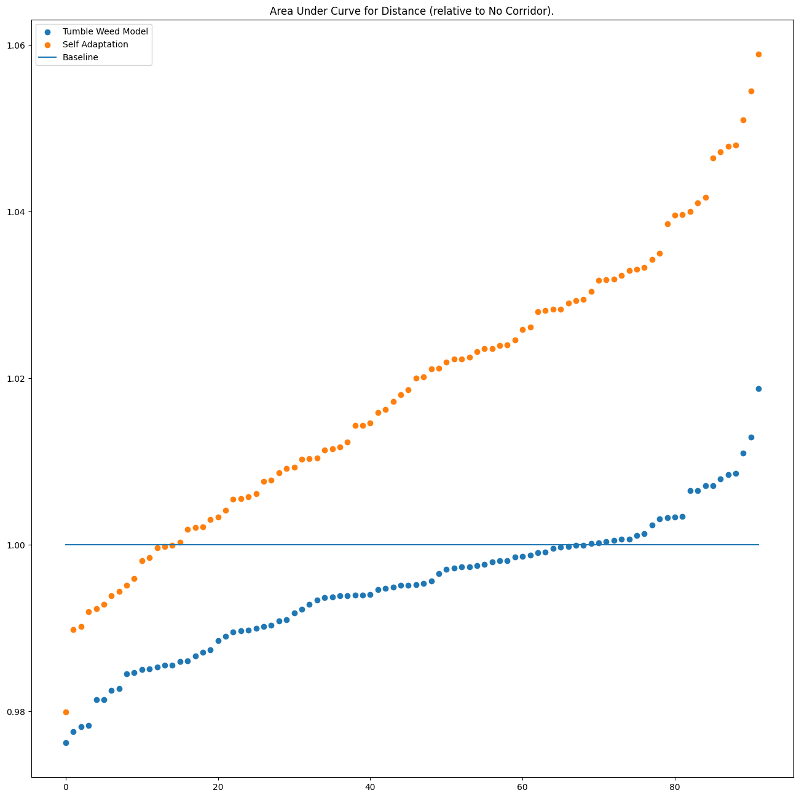
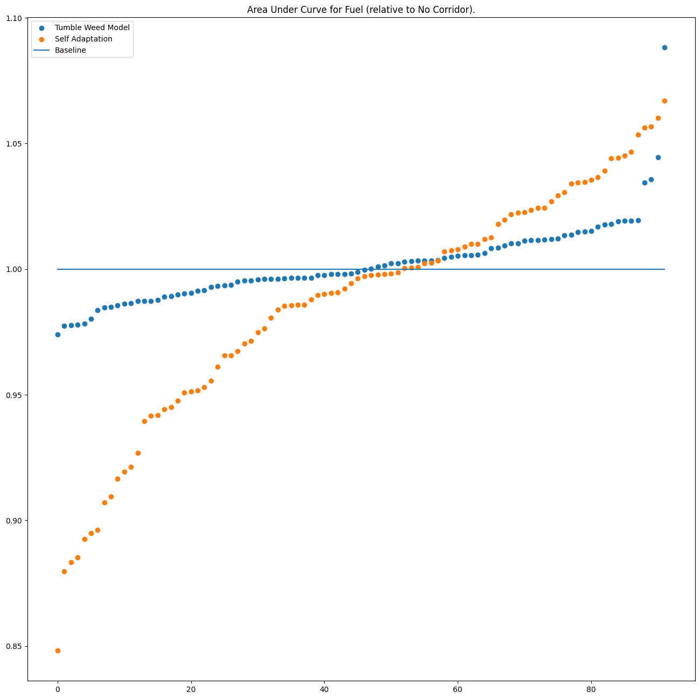
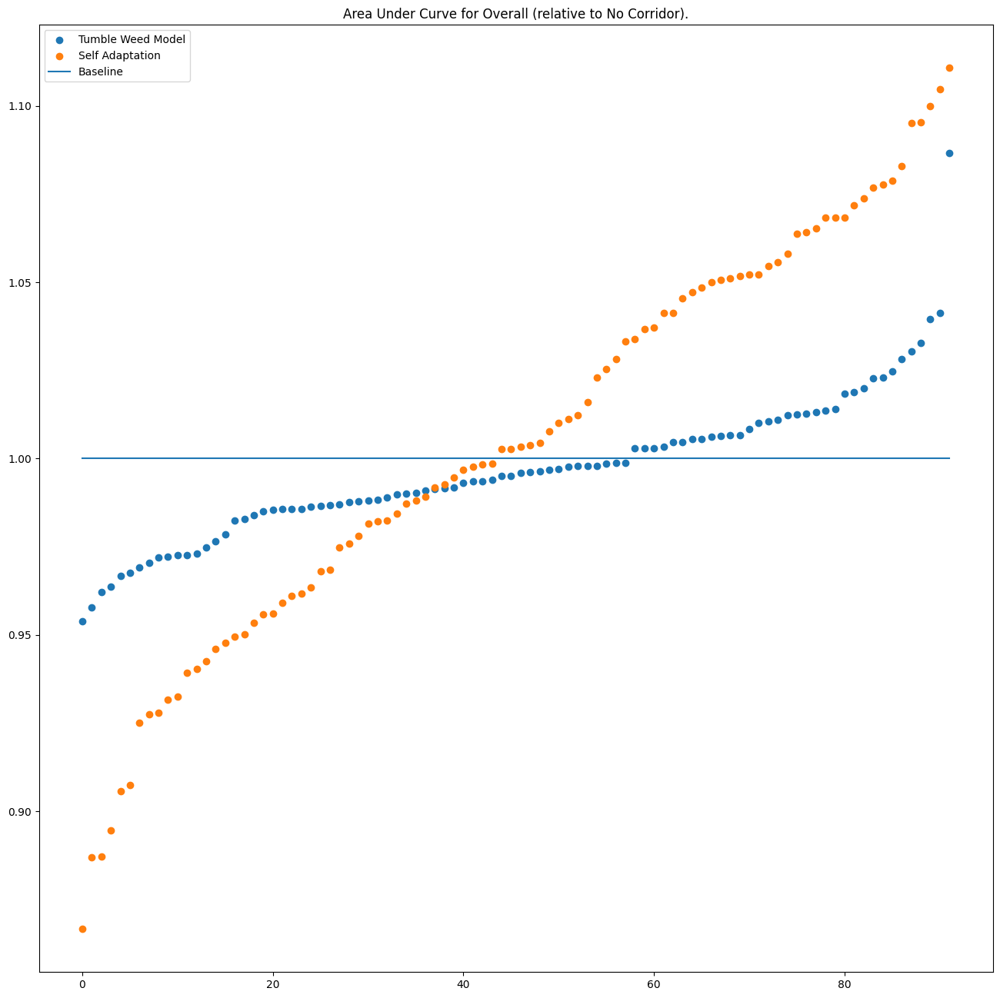

# A Fast Converging Evolutionary Algorithm for Green Vehicle Routing Problem
[](https://www.swift.org)

A Genetic Algorithm, for Green Vehicle Routing Problem that is speed up by disciplined mutation by means of `Corridor Model` from Evolutionary Strategies, written completely in Swift.

## Thinking Behind Algorithm
Inspired by the Corridor Model from Evolutionary Strategies, we introduce an analogue using Dot Product and Probabilitstic Roulette Operator to help drastically improve the inter-generation convergence speed. Instead of focusing on "What mutator do I use?" we focused on "How the mutator mutate?" and using the locality of customers with respect to the depot, we approximate relatively optimal mutations for faster convergence. 

We also introduced a more optimal initialisation algorithm that helps start the algorithm at 30% shorted travel distance, to further speed up the convergence. The fast convergence allows the algorithm to:

*  Spend the remaining iteration on optimising for other objectives.
*  Provide a good initial population for other multi-objective optimisation VRP problems.

A short research paper is soon going to be published in ACM journal, by GECCO 2024 Australia Conference, the citation details can be found below:
```
\copyrightyear{2024}
\acmYear{2024}
\setcopyright{rightsretained}
\acmConference[GECCO '24 Companion]{Genetic and Evolutionary Computation Conference}{July 14--18, 2024}{Melbourne, VIC, Australia}
\acmBooktitle{Genetic and Evolutionary Computation Conference (GECCO '24 Companion), July 14--18, 2024, Melbourne, VIC, Australia}
\acmDOI{10.1145/3638530.3654323}
\acmISBN{979-8-4007-0495-6/24/07}
```

## How to Build
We have provided a make shell script that takes in one of the following arguement and build the associated model executable:
1. `TumbleWeedModel`: is a model that searches for optimal strictness, with former pareto fronts exploring and later exploiting.
2. `SelfAdaptationModel`: is a model that searches for optimal strictness using normal random number generation.
3. `NoCorridorModel`: is a tradational complete random mutation model.
To get an executable just run `bash make.sh <One of the above model names>`. This will generate `run` file that takes in some arguement, if not provided it runs all the benchmarks 10 times for statistical relevance.

A macOS app will also be made available to help visualise the main contributions of this research.

## How to use
For Xcode user, simple open the Xcode build the project, and copy the `Benchmarks` folders into the same directory where the built target is created. Then use:

 `./<Executable Name> contains <Benchmark Substring>` for running certain subsets of the benchmarks that contains the substring : eg `./Experiment\ 6 contains A-n32-k5`. 

Similary one can also run it on all the benchmark including and after the `./<Executable Name> after <Benchmark Name>`, eg `./Experiment 6 after M-n200-k17`.

For all other platforms, in the root folder of the repository `swiftc -o <Output File Name> <List of all *.swift files in directory>`, then simply `./<Output File Name>`.

The algorithm will return files `<Benchmark Namme>.json`, which is the benchmark repsresentation. `convergence (*).json` contains the time series of distance and fuel evaluation with the $length = iterationCount + 1$, the extra on it the initialisation evaluation. `front (*).json` contains the pareto front of the Distance vs Fuel evaluation. In the aforementioned file `*` denotes the run number the range of which can be change in `main.swift`. The defination of Benchmark files is:
```
struct EncodedBenchmark : Codable {
    let benchmark : String
    let customers : [EncodedCustomer]
    let fleetSize : Int
    let vehicleCapcity : Int
    let optimal : Int?
}
```
where EncodedCustomer is:
```
struct EncodedCustomer : Codable {
    let id : Int
    let x : Double
    let y : Double
    let demand : Int
}
```
convergence:
 
 ```
 struct Convergence : Encodable {
    let benchmark : String
    let optimalDistance : Int?
    let distanceSequence : [Double]
    let fuelSequence : [Double]
}
 ```

pareto front:
```
struct SaveData : Encodable {
    let benchmark : String
    let Optimal : Int?
    let front : [EncodableRoutine]
}
```
one can use the json format to run their own custom benchmark. The depot is marked by setting `demand = 0` and it is 1 depot problem solver, so only one customer can have `demand = 0`.

## Results
Find below the results obtained by the algorithm, starting with the 
initialisation results:


The convergence speed Comparison Distance:

The convergence speed Comparison Fuel:


The convergence speed Comparison Overall:



---